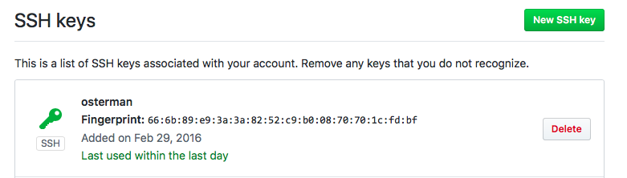
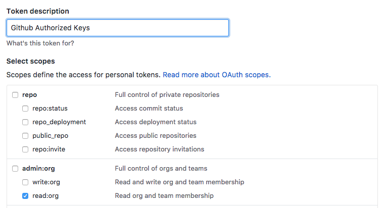

<!-- This file was automatically generated by the `build-harness`. Make all changes to `README.yaml` and run `make readme` to rebuild this file. -->

[](https://cloudposse.com)

# github-authorized-keys [](https://travis-ci.org/cloudposse/github-authorized-keys) [](https://github.com/cloudposse/github-authorized-keys/releases/latest) [](https://slack.cloudposse.com)


Use GitHub teams to manage system user accounts and `authorized_keys`. 
----

## Screenshots

**Administrators** 
* Automatically provision new users to production servers simply by adding them to a designatd GitHub team (e.g. `ssh`). 
  
* No need to keep `authorized_keys` up to date because keys are pulled directly from github.com API and *optionally* cached in etcd
* Immediately revoke SSH access to servers by evicting users from the GitHub team
* Easy to deploy

**End Users**
* Self-administer public SSH keys via the [GitHub account settings](https://github.com/settings/keys).
  
* No need to manage multiple SSH keys

## Architecture

This tool consists of three parts:

1. User Account / Authorized Keys provisioner which polls [GitHub API for users](https://developer.github.com/v3/users/keys/) that correspond to a given GitHub Organization & Team using a [personal access token](https://github.com/settings/tokens). It's responsible for adding or removing users from the system. All commands are templatized to allow it to run on multiple distributions. 
2. Simple read-only REST API that provides public keys for users, which is used by the `AuthorizedKeysCommand` in the `sshd_config`; this allows you to expose the service internally without compromising your Github Token. The public SSH access keys are *optionally* cached in Etcd for performance and reliability.
3. An `AuthorizedKeysCommand` [script](contrib/authorized-keys) that will `curl` the REST API for a user's public keys.


---

This project is part of our comprehensive ["SweetOps"](https://docs.cloudposse.com) approach towards DevOps. 


It's 100% Open Source and licensed under the [APACHE2](LICENSE).


## Usage

## Getting Started

By far, the easiest way to get up and running is by using the ready-made docker container. The only dependency is [Docker](https://docs.docker.com/engine/installation) itself. We also provide a [Kubernetes Helm Chart](https://github.com/cloudposse/charts/tree/master/incubator/github-authorized-keys). If you run [CoreOS](docs/coreos.md) or use `systemd`, there's a [sample unit file](contrib/github-authorized-keys.service).

Cloud Posse provides a public image [cloudposse/github-authorized-keys](https://hub.docker.com/r/cloudposse/github-authorized-keys/) that is built using [TravisCI](.travis.yml) or you can build your own from source.

```
docker build -t cloudposse/github-authorized-keys .
```

### Running GitHub Authorized Keys

All arguments can be passed both as environment variables or command-line arguments, or even mix-and-match them to suit your tastes.

Available configuration options:

| **Environment Variable** | **Argument**             | **Description**                                   | **Default**              |
|--------------------------|--------------------------|---------------------------------------------------|--------------------------|
| `GITHUB_API_TOKEN`       | `--github-api-token`     | GitHub API Token (read-only)                      |                          |
| `GITHUB_ORGANIZATION`    | `--github-organization`  | GitHub Organization Containing Team               |                          |
| `GITHUB_TEAM`            | `--github-team`          | GitHub Team for Membership to Grant SSH Access    |                          |
| `GITHUB_TEAM_ID`         | `--github-team-id`       | GitHub Team ID for Membership to Grant SSH Access |                          |
| `SYNC_USERS_GID`         | `--sync-users-gid`       | Default Group ID (aka `gid`) of users             |                          |
| `SYNC_USERS_GROUPS`      | `--sync-users-groups`    | Default "Extra" Groups                            |                          |
| `SYNC_USERS_SHELL`       | `--sync-users-shell`     | Default Login Shell                               | `/bin/bash`              |
| `SYNC_USERS_ROOT`        | `--sync-users-root`      | `chroot` path for user commands                   | `/`                      |
| `SYNC_USERS_INTERVAL`    | `--sync-users-interval`  | Interval used to update user accounts             | `300`                    |
| `ETCD_ENDPOINT`          | `--etcd-endpoint`        | Etcd endpoint used for caching public keys        |                          |
| `ETCD_TTL`               | `--etcd-ttl`             | Duration (in seconds) to cache public keys        | `86400`                  |
| `ETCD_PREFIX`            | `--etcd-prefix`          | Prefix for public keys stored in etcd             | `github-authorized-keys` |
| `LISTEN`                 | `--listen`               | Bind address used for REST API                    | `:301`                   |
| `INTEGRATE_SSH`          | `--integrate-ssh`        | Flag to automatically configure SSH               | `false`                  |
| `LOG_LEVEL`              | `--log-level`            | Ccontrol the logging verbosity.                   | `info`                   |

## Quick Start

We recommend that you specify all parameters as environment variables. If using `docker`, pass the [environment file](contrib/env) to the container using the `--env-file` argument.

Obtain the GitHub API Token (aka Personal Access Token) [here](https://github.com/settings/tokens). Click "Generate new token" and select `read:org`. That's it!




For example, [`/etc/github-authorized-keys`](contrib/env), might look like this:

```
GITHUB_API_TOKEN={token}
GITHUB_ORGANIZATION={organization}
GITHUB_TEAM=ssh
SYNC_USERS_GID=500
SYNC_USERS_GROUPS=sudo
SYNC_USERS_SHELL=/bin/bash
SYNC_USERS_ROOT=/host
SYNC_USERS_INTERVAL=300
ETCD_ENDPOINT=http://localhost:2739
ETCD_TTL=86400
ETCD_PREFIX=github-authorized-keys
LISTEN=:301
INTEGRATE_SSH=true
```

Then you could start it like this:

```
docker run \
  --volume /:/host \
  --expose "127.0.0.1:301:301" \
  --env-file /etc/github-authorized-keys \
    cloudposse/github-authorized-keys:latest
```

**IMPORTANT** Remember to expose the REST API so you can retrieve user's public keys. Only public keys belonging to users found in the GitHub team will be returned.

**Note:** depending on your OS distribution, you might need to tweak the command templates. Keep reading for details.


## Examples

### Automatically Configure SSH

To leverage the `github-authorized-keys` API, we need to make a small tweak to the `sshd_config`. 

This can be done automatically by passing the `--integrate-ssh` flag (or setting `INTEGRATE_SSH=true`)

After modifying the `sshd_config`, it's necessary to restart the SSH daemon. This happens automatically by calling the `SSH_RESTART_TPL` command. Since this differs depending on the OS distribution, you can change the default behavior by setting the `SSH_RESTART_TPL` environment variable (default: `/usr/sbin/service ssh force-reload`). Similarly, you might need to tweak the `AUTHORIZED_KEYS_COMMAND_TPL` environment variable to something compatible with your OS.


### Manually Configure SSH

If you wish to manually configure your `sshd_config`, here's all you need to do:

```
AuthorizedKeysCommand /usr/bin/authorized-keys
AuthorizedKeysCommandUser root
```

Then install a [wrapper script](contrib/authorized-keys) to `/usr/bin/authorized-keys`. 

**Note**: this command requires `curl` to access the REST API in order to fetch authorized keys

### Etcd Fallback Cache

The REST API supports Etcd as cache for public keys. This mitigates any connectivity problems with GitHub's API. By default, the caching is disabled.

### Command Templates

Due to the vast differences between OS commands, the defaults provided might not work for you flavor of Linux.

Below are some of the settings which can be tweaked. 

| Environment Variable           | **Description**                                                                 | **Default**                                   
|--------------------------------|---------------------------------------------------------------------------------|-------------------------------------------------------------------------
| `LINUX_USER_ADD_TPL`           | Command used to add a user to the system when no default group supplied.        | `adduser {username} --disabled-password --force-badname --shell {shell}`                 
| `LINUX_USER_ADD_WITH_GID_TPL`  | Command used to add a user to the system when a default primary gid supplied  . | `adduser {username} --disabled-password --force-badname --shell {shell} --gid {gid|group}`
| `LINUX_USER_ADD_TO_GROUP_TPL`  | Command used to add the user to secondary groups                                | `adduser {username} {group}` 
| `LINUX_USER_DEL_TPL`           | Command used to delete a user from the system when removed the the team         | `deluser {username}`
| `SSH_RESTART_TPL`              | Command used to restart SSH when `INTEGRATE_SSH=true`                           | `/usr/sbin/service ssh force-reload`
| `AUTHORIZED_KEYS_COMMAND_TPL`  | Command used to fetch a user's `authorized_keys` from REST API                  | `/usr/bin/github-authorized-keys`

The values in `{braces}` are macros that will be automatically substituted at run-time.

| **Macro**     | **Description**            |
|---------------|----------------------------|
| `{username}`  | User's login name          |
| `{shell}`     | User's login shell         |
| `{group}`     | User's primary group name  |
| `{gid}`       | User's primary group id    |  


## Help

**Got a question?**

File a GitHub [issue](https://github.com/cloudposse/github-authorized-keys/issues), send us an [email][email] or join our [Slack Community][slack].

## Commerical Support

Work directly with our team of DevOps experts via email, slack, and video conferencing. 

We provide *commercial support* for all of our [Open Source][github] projects. As a *Dedicated Support* customer, you have access to our team of subject matter experts at a fraction of the cost of a fulltime engineer. 

[](mailto:hello@cloudposse.com)

- **Questions.** We'll use a Shared Slack channel between your team and ours.
- **Troubleshooting.** We'll help you triage why things aren't working.
- **Code Reviews.** We'll review your Pull Requests and provide constructive feedback.
- **Bug Fixes.** We'll rapidly work to fix any bugs in our projects.
- **Build New Terraform Modules.** We'll develop original modules to provision infrastructure.
- **Cloud Architecture.** We'll assist with your cloud strategy and design.
- **Implementation.** We'll provide hands on support to implement our reference architectures. 


## Community Forum

Get access to our [Open Source Community Forum][slack] on Slack. It's **FREE** to join for everyone! Our "SweetOps" community is where you get to talk with others who share a similar vision for how to rollout and manage infrastructure. This is the best place to talk shop, ask questions, solicit feedback, and work together as a community to build *sweet* infrastructure.

## Contributing

### Bug Reports & Feature Requests

Please use the [issue tracker](https://github.com/cloudposse/github-authorized-keys/issues) to report any bugs or file feature requests.

### Developing

If you are interested in being a contributor and want to get involved in developing this project or [help out](https://github.com/orgs/cloudposse/projects/3) with our other projects, we would love to hear from you! Shoot us an [email](mailto:hello@cloudposse.com).

In general, PRs are welcome. We follow the typical "fork-and-pull" Git workflow.

 1. **Fork** the repo on GitHub
 2. **Clone** the project to your own machine
 3. **Commit** changes to your own branch
 4. **Push** your work back up to your fork
 5. Submit a **Pull Request** so that we can review your changes

**NOTE:** Be sure to merge the latest changes from "upstream" before making a pull request!

## Copyright

Copyright © 2017-2018 [Cloud Posse, LLC](https://cloudposse.com)


## License 

[](https://opensource.org/licenses/Apache-2.0) 

See [LICENSE](LICENSE) for full details.

    Licensed to the Apache Software Foundation (ASF) under one
    or more contributor license agreements.  See the NOTICE file
    distributed with this work for additional information
    regarding copyright ownership.  The ASF licenses this file
    to you under the Apache License, Version 2.0 (the
    "License"); you may not use this file except in compliance
    with the License.  You may obtain a copy of the License at

      https://www.apache.org/licenses/LICENSE-2.0

    Unless required by applicable law or agreed to in writing,
    software distributed under the License is distributed on an
    "AS IS" BASIS, WITHOUT WARRANTIES OR CONDITIONS OF ANY
    KIND, either express or implied.  See the License for the
    specific language governing permissions and limitations
    under the License.


## Trademarks

All other trademarks referenced herein are the property of their respective owners.

## About

This project is maintained and funded by [Cloud Posse, LLC][website]. Like it? Please let us know at <hello@cloudposse.com>

[](https://cloudposse.com)

We're a [DevOps Professional Services][hire] company based in Los Angeles, CA. We love [Open Source Software](https://github.com/cloudposse/)!

We offer paid support on all of our projects.  

Check out [our other projects][github], [apply for a job][jobs], or [hire us][hire] to help with your cloud strategy and implementation.

  [docs]: https://docs.cloudposse.com/
  [website]: https://cloudposse.com/
  [github]: https://github.com/cloudposse/
  [jobs]: https://cloudposse.com/jobs/
  [hire]: https://cloudposse.com/contact/
  [slack]: https://slack.cloudposse.com/
  [linkedin]: https://www.linkedin.com/company/cloudposse
  [twitter]: https://twitter.com/cloudposse/
  [email]: mailto:hello@cloudposse.com


### Contributors

|  [![Erik Osterman][osterman_avatar]](osterman_homepage)<br/>[Erik Osterman][osterman_homepage] | [![Igor Rodionov][goruha_avatar]](goruha_homepage)<br/>[Igor Rodionov][goruha_homepage] |
|---|---|

  [osterman_homepage]: https://github.com/osterman
  [osterman_avatar]: https://github.com/osterman.png?size=150
  [goruha_homepage]: https://github.com/goruha
  [goruha_avatar]: https://github.com/goruha.png?size=150


